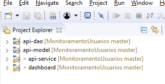

# E-eye

Para a utilização, serão necessários:

JDK 1.8+ (http://www.oracle.com/technetwork/pt/java/javase/downloads/index.html)
Um banco local MongoDB rodando (https://www.mongodb.com/)
Um banco Mysql rodando, para maior facilidade usamos o WAMP para o desenvolvimento (http://www.wampserver.com/en/)
Uma instalação do maven (a maioria das IDEs para Java hoje em dia tem) (https://maven.apache.org/)
Lombok instalado para sua IDE (https://projectlombok.org/)

Em sua IDE, importe os módulos (api-dao, api-model, api-service, dashboard) do sistema como maven projects. Deve resultar em algo como isso:

